# 7–10. Document Lifecycle Diagrams

General rules for every document state machine:

* Transitions are **methods on the aggregate** (`invoice.Post(…)`), never `Status = x` setters. Invalid transitions return a domain error (HTTP 409 `invalid-state-transition`).
* Every transition writes `DocumentStatusHistory` and an audit record.
* **Approval is a gate, not a posting.** If an approval definition matches, `Submit` moves the document to `PendingApproval`; the Workflow engine's `ApprovalCompleted` event moves it to `Approved`. If no definition matches, the document goes straight to `Approved`. Posting is always an explicit, separately-authorized command (optionally auto-triggered by policy).
* Posted documents are immutable; corrections are new documents (reversal, return, adjustment).

## 7. Inventory lifecycles

### 7.1 Opening stock

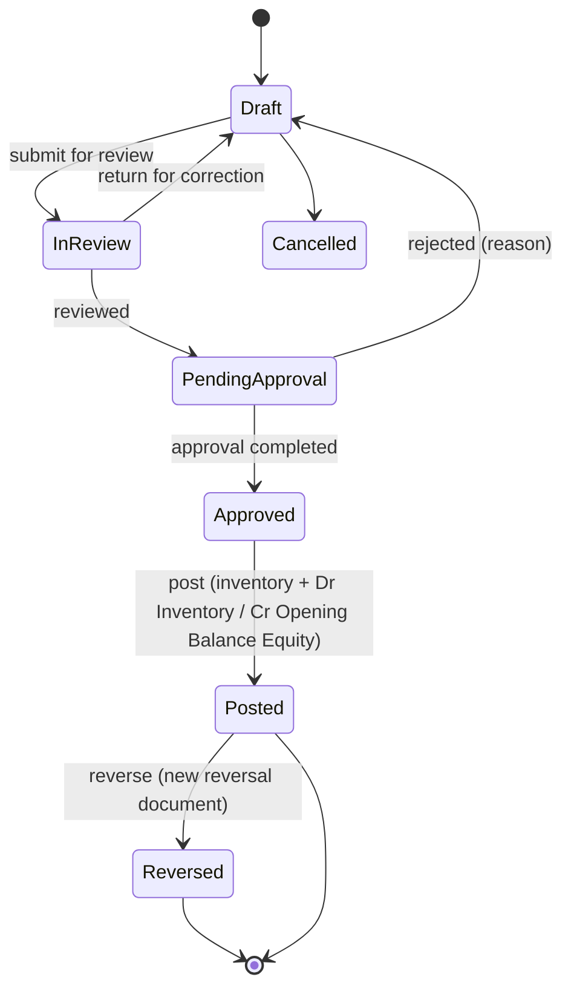
```mermaid
stateDiagram-v2
    [*] --> Draft
    Draft --> InReview: submit for review
    InReview --> Draft: return for correction
    InReview --> PendingApproval: reviewed
    PendingApproval --> Approved: approval completed
    PendingApproval --> Draft: rejected (reason)
    Approved --> Posted: post (inventory + Dr Inventory / Cr Opening Balance Equity)
    Posted --> Reversed: reverse (new reversal document)
    Draft --> Cancelled
    Reversed --> [*]
    Posted --> [*]
```

### 7.2 Stock transfer

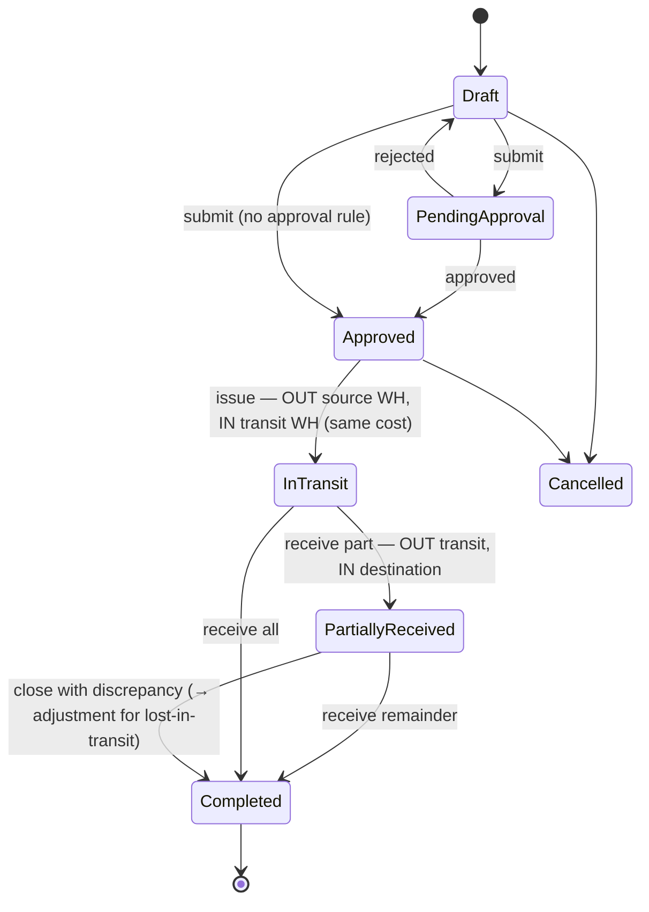
```mermaid
stateDiagram-v2
    [*] --> Draft
    Draft --> PendingApproval: submit
    PendingApproval --> Approved: approved
    PendingApproval --> Draft: rejected
    Draft --> Approved: submit (no approval rule)
    Approved --> InTransit: issue — OUT source WH, IN transit WH (same cost)
    InTransit --> PartiallyReceived: receive part — OUT transit, IN destination
    PartiallyReceived --> Completed: receive remainder
    InTransit --> Completed: receive all
    PartiallyReceived --> Completed: close with discrepancy (→ adjustment for lost-in-transit)
    Draft --> Cancelled
    Approved --> Cancelled
    Completed --> [*]
```

Same-valuation-area transfers produce **no GL entry** (inventory account unchanged) unless warehouses map to different inventory accounts by posting rules, in which case Dr Inventory(dest) / Cr Inventory(source) is posted at receive (transit account at issue). Cross-legal-entity transfers are blocked until intercompany is designed (MR-4).

### 7.3 Stock count

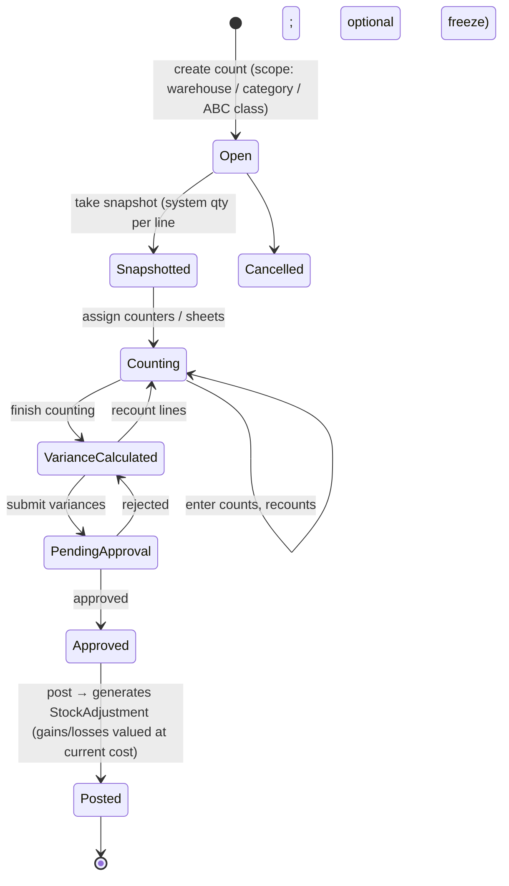
```mermaid
stateDiagram-v2
    [*] --> Open: create count (scope: warehouse / category / ABC class)
    Open --> Snapshotted: take snapshot (system qty per line; optional freeze)
    Snapshotted --> Counting: assign counters / sheets
    Counting --> Counting: enter counts, recounts
    Counting --> VarianceCalculated: finish counting
    VarianceCalculated --> Counting: recount lines
    VarianceCalculated --> PendingApproval: submit variances
    PendingApproval --> Approved: approved
    PendingApproval --> VarianceCalculated: rejected
    Approved --> Posted: post → generates StockAdjustment (gains/losses valued at current cost)
    Open --> Cancelled
    Posted --> [*]
```

Variance per line = `Counted − (SnapshotQty + Σ movements after snapshot)` (snapshot mode, OQ-INV-6).

### 7.4 Stock adjustment

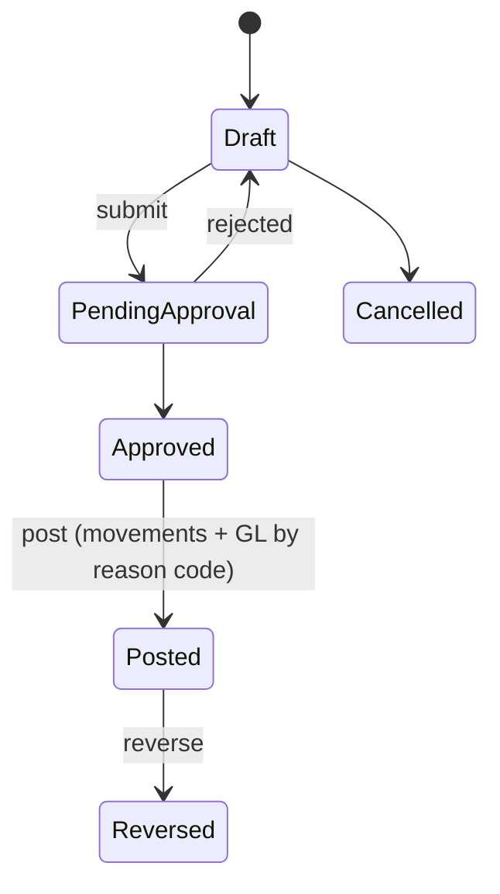
```mermaid
stateDiagram-v2
    [*] --> Draft
    Draft --> PendingApproval: submit
    PendingApproval --> Approved
    PendingApproval --> Draft: rejected
    Approved --> Posted: post (movements + GL by reason code)
    Posted --> Reversed: reverse
    Draft --> Cancelled
```

### 7.5 Reservation lifecycle (per demand line)

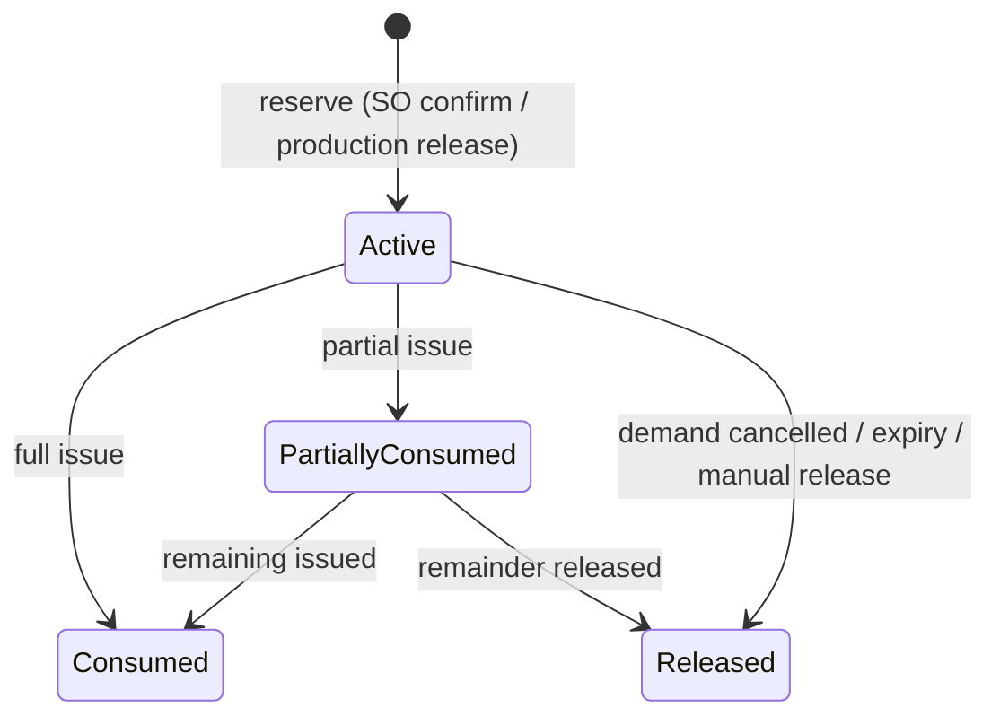
```mermaid
stateDiagram-v2
    [*] --> Active: reserve (SO confirm / production release)
    Active --> PartiallyConsumed: partial issue
    PartiallyConsumed --> Consumed: remaining issued
    Active --> Consumed: full issue
    Active --> Released: demand cancelled / expiry / manual release
    PartiallyConsumed --> Released: remainder released
```

### 7.6 Serial number lifecycle

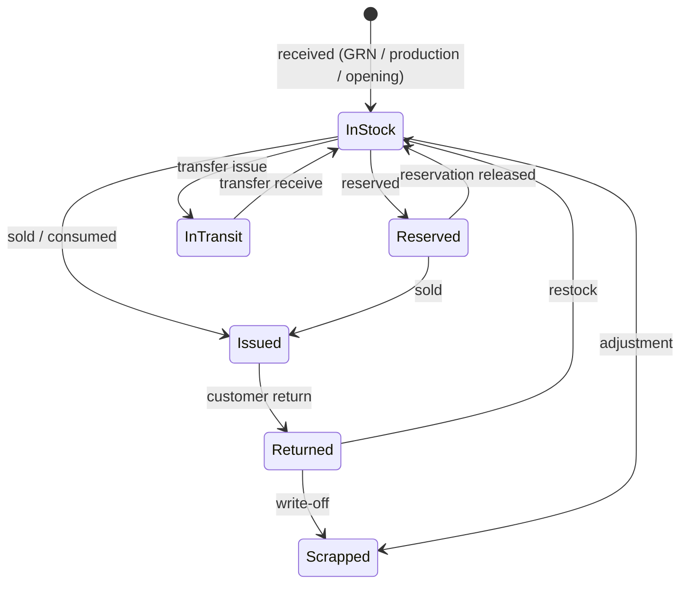
```mermaid
stateDiagram-v2
    [*] --> InStock: received (GRN / production / opening)
    InStock --> Reserved: reserved
    Reserved --> InStock: reservation released
    InStock --> InTransit: transfer issue
    InTransit --> InStock: transfer receive
    InStock --> Issued: sold / consumed
    Reserved --> Issued: sold
    Issued --> Returned: customer return
    Returned --> InStock: restock
    Returned --> Scrapped: write-off
    InStock --> Scrapped: adjustment
```

## 8. Sales lifecycles

### 8.1 Quotation

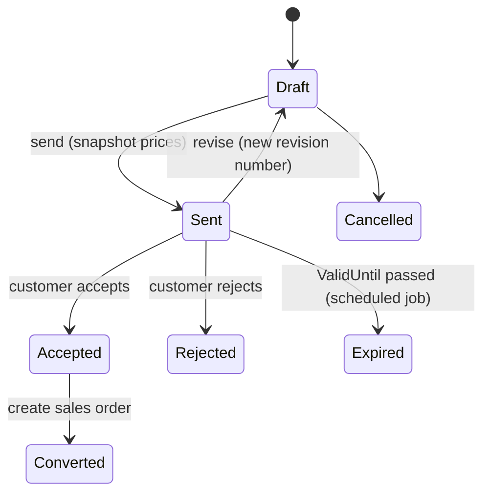
```mermaid
stateDiagram-v2
    [*] --> Draft
    Draft --> Sent: send (snapshot prices)
    Sent --> Accepted: customer accepts
    Sent --> Rejected: customer rejects
    Sent --> Expired: ValidUntil passed (scheduled job)
    Sent --> Draft: revise (new revision number)
    Accepted --> Converted: create sales order
    Draft --> Cancelled
```

### 8.2 Sales order

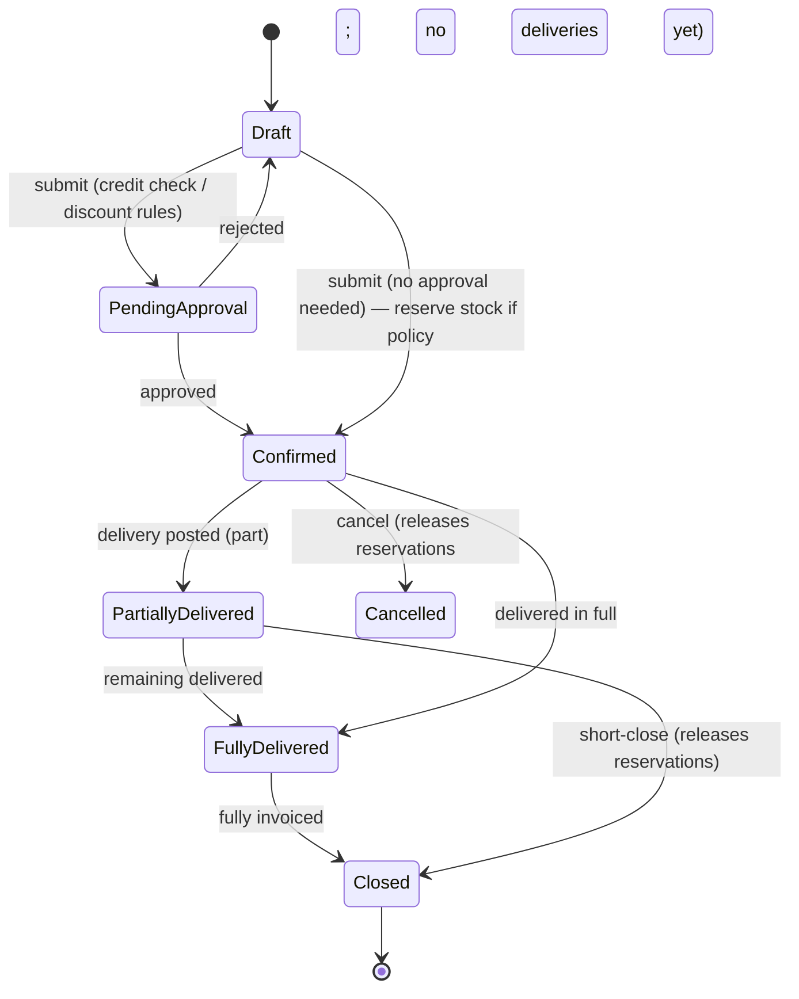
```mermaid
stateDiagram-v2
    [*] --> Draft
    Draft --> PendingApproval: submit (credit check / discount rules)
    PendingApproval --> Confirmed: approved
    PendingApproval --> Draft: rejected
    Draft --> Confirmed: submit (no approval needed) — reserve stock if policy
    Confirmed --> PartiallyDelivered: delivery posted (part)
    PartiallyDelivered --> FullyDelivered: remaining delivered
    Confirmed --> FullyDelivered: delivered in full
    FullyDelivered --> Closed: fully invoiced
    PartiallyDelivered --> Closed: short-close (releases reservations)
    Confirmed --> Cancelled: cancel (releases reservations; no deliveries yet)
    Closed --> [*]
```

### 8.3 Sales invoice

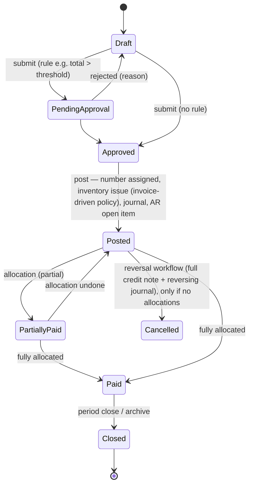
```mermaid
stateDiagram-v2
    [*] --> Draft
    Draft --> PendingApproval: submit (rule e.g. total > threshold)
    PendingApproval --> Approved
    PendingApproval --> Draft: rejected (reason)
    Draft --> Approved: submit (no rule)
    Approved --> Posted: post — number assigned, inventory issue (invoice-driven policy), journal, AR open item
    Posted --> PartiallyPaid: allocation (partial)
    PartiallyPaid --> Paid: fully allocated
    Posted --> Paid: fully allocated
    Paid --> Closed: period close / archive
    Posted --> Cancelled: reversal workflow (full credit note + reversing journal), only if no allocations
    PartiallyPaid --> Posted: allocation undone
    Closed --> [*]
```

`PartiallyPaid` / `Paid` are **settlement states derived from Finance open items** (`InvoiceSettled` event) — the Sales invoice does not compute them itself.

### 8.4 Delivery note (delivery-driven policy)

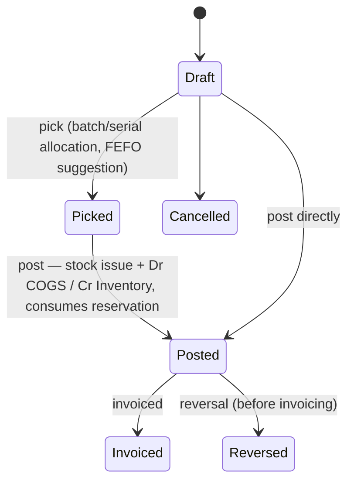
```mermaid
stateDiagram-v2
    [*] --> Draft
    Draft --> Picked: pick (batch/serial allocation, FEFO suggestion)
    Picked --> Posted: post — stock issue + Dr COGS / Cr Inventory, consumes reservation
    Draft --> Posted: post directly
    Posted --> Invoiced: invoiced
    Posted --> Reversed: reversal (before invoicing)
    Draft --> Cancelled
```

### 8.5 Sales return / credit note

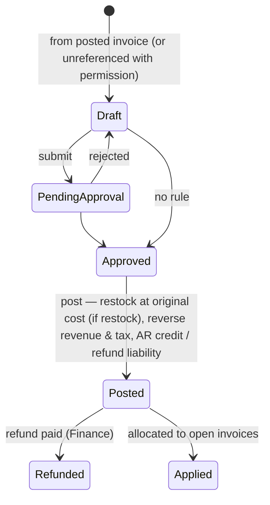
```mermaid
stateDiagram-v2
    [*] --> Draft: from posted invoice (or unreferenced with permission)
    Draft --> PendingApproval: submit
    PendingApproval --> Approved
    PendingApproval --> Draft: rejected
    Draft --> Approved: no rule
    Approved --> Posted: post — restock at original cost (if restock), reverse revenue & tax, AR credit / refund liability
    Posted --> Refunded: refund paid (Finance)
    Posted --> Applied: allocated to open invoices
```

## 9. Procurement lifecycles

### 9.1 Purchase request

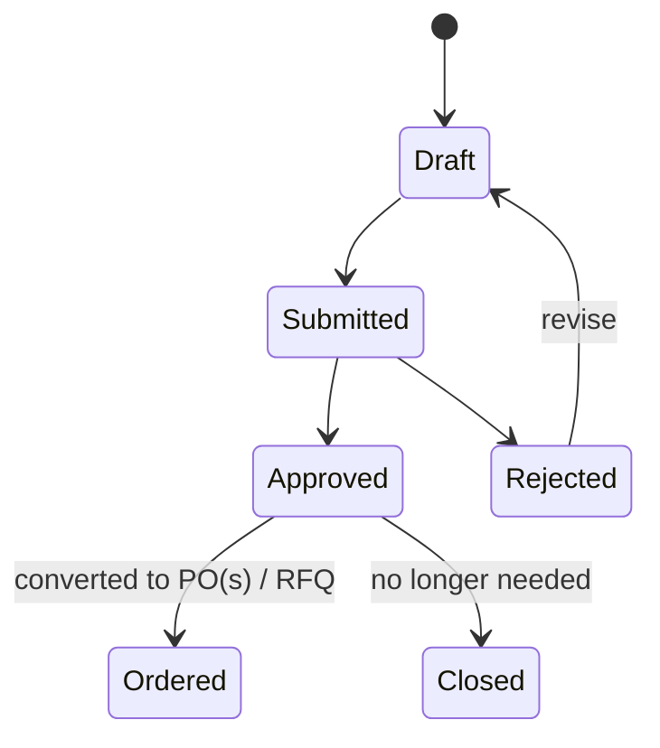
```mermaid
stateDiagram-v2
    [*] --> Draft
    Draft --> Submitted
    Submitted --> Approved
    Submitted --> Rejected
    Rejected --> Draft: revise
    Approved --> Ordered: converted to PO(s) / RFQ
    Approved --> Closed: no longer needed
```

### 9.2 Purchase order

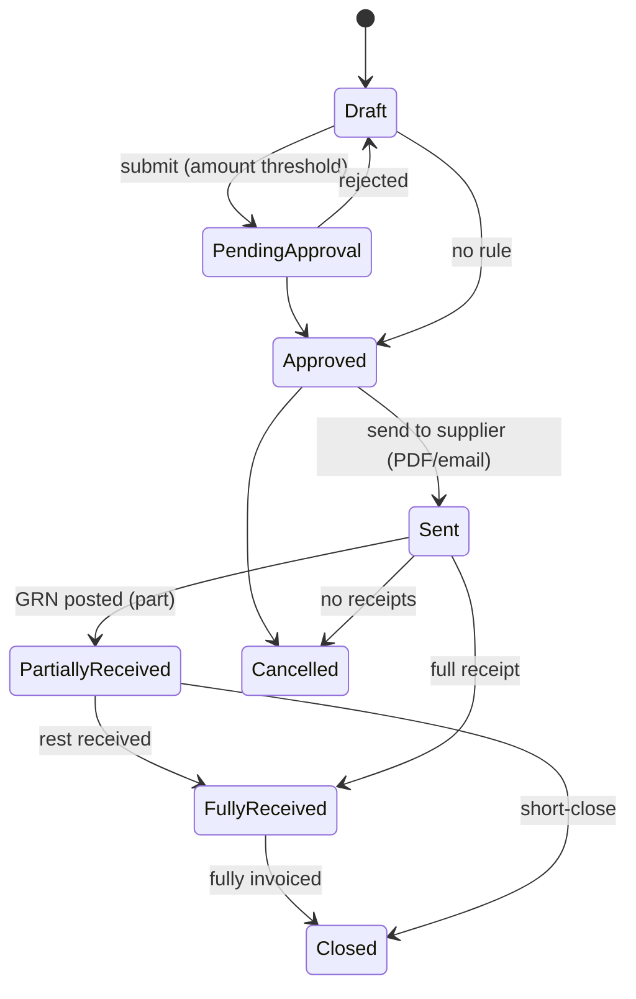
```mermaid
stateDiagram-v2
    [*] --> Draft
    Draft --> PendingApproval: submit (amount threshold)
    PendingApproval --> Approved
    PendingApproval --> Draft: rejected
    Draft --> Approved: no rule
    Approved --> Sent: send to supplier (PDF/email)
    Sent --> PartiallyReceived: GRN posted (part)
    PartiallyReceived --> FullyReceived: rest received
    Sent --> FullyReceived: full receipt
    FullyReceived --> Closed: fully invoiced
    PartiallyReceived --> Closed: short-close
    Approved --> Cancelled
    Sent --> Cancelled: no receipts
```

### 9.3 Goods receipt

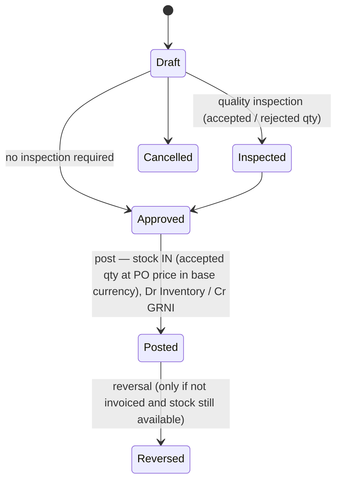
```mermaid
stateDiagram-v2
    [*] --> Draft
    Draft --> Inspected: quality inspection (accepted / rejected qty)
    Draft --> Approved: no inspection required
    Inspected --> Approved
    Approved --> Posted: post — stock IN (accepted qty at PO price in base currency), Dr Inventory / Cr GRNI
    Posted --> Reversed: reversal (only if not invoiced and stock still available)
    Draft --> Cancelled
```

### 9.4 Purchase invoice

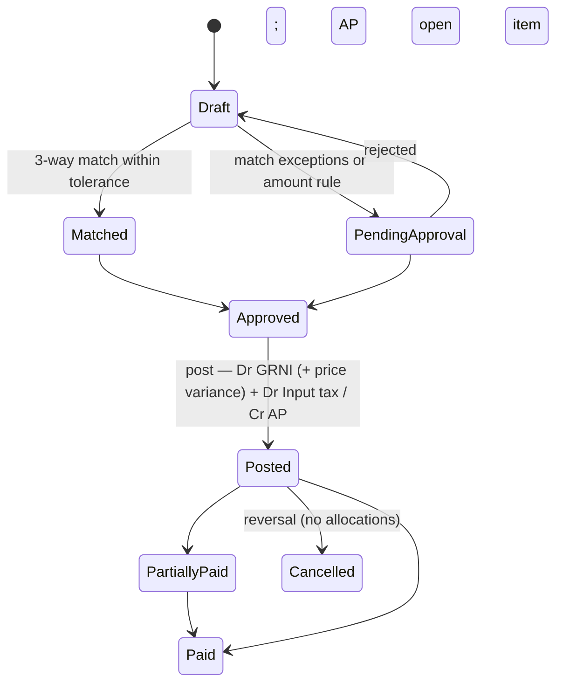
```mermaid
stateDiagram-v2
    [*] --> Draft
    Draft --> Matched: 3-way match within tolerance
    Draft --> PendingApproval: match exceptions or amount rule
    Matched --> Approved
    PendingApproval --> Approved
    PendingApproval --> Draft: rejected
    Approved --> Posted: post — Dr GRNI (+ price variance) + Dr Input tax / Cr AP; AP open item
    Posted --> PartiallyPaid
    PartiallyPaid --> Paid
    Posted --> Paid
    Posted --> Cancelled: reversal (no allocations)
```

### 9.5 Purchase return / debit note

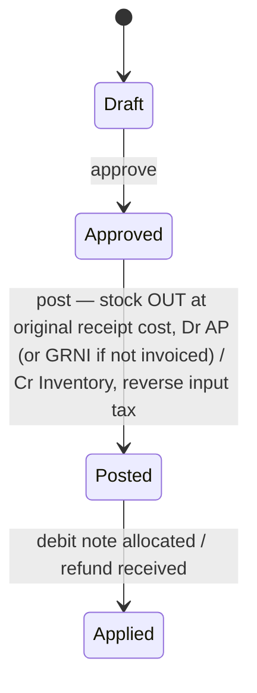
```mermaid
stateDiagram-v2
    [*] --> Draft
    Draft --> Approved: approve
    Approved --> Posted: post — stock OUT at original receipt cost, Dr AP (or GRNI if not invoiced) / Cr Inventory, reverse input tax
    Posted --> Applied: debit note allocated / refund received
```

## 10. Manufacturing lifecycles

### 10.1 Production order

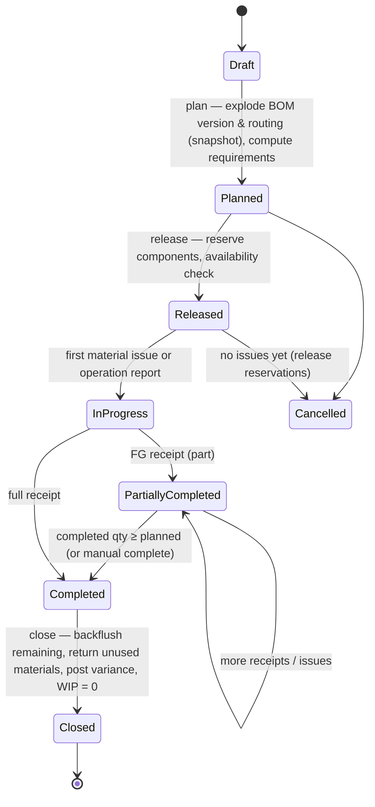
```mermaid
stateDiagram-v2
    [*] --> Draft
    Draft --> Planned: plan — explode BOM version & routing (snapshot), compute requirements
    Planned --> Released: release — reserve components, availability check
    Released --> InProgress: first material issue or operation report
    InProgress --> PartiallyCompleted: FG receipt (part)
    PartiallyCompleted --> PartiallyCompleted: more receipts / issues
    PartiallyCompleted --> Completed: completed qty ≥ planned (or manual complete)
    InProgress --> Completed: full receipt
    Completed --> Closed: close — backflush remaining, return unused materials, post variance, WIP = 0
    Planned --> Cancelled
    Released --> Cancelled: no issues yet (release reservations)
    Closed --> [*]
```

### 10.2 Production flow (inventory & WIP effects)

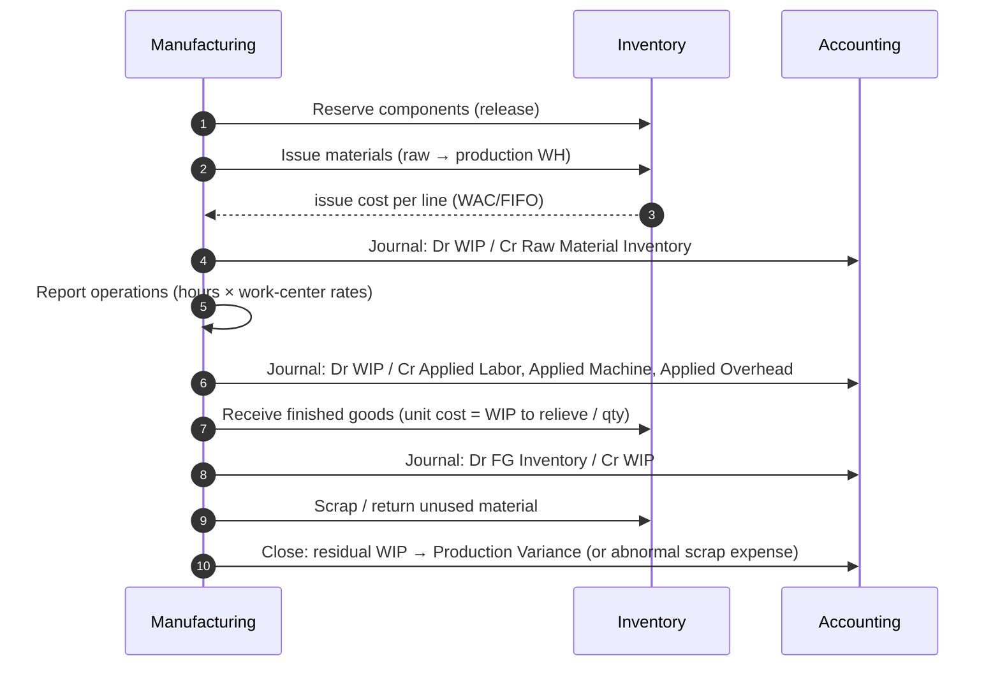
```mermaid
sequenceDiagram
    autonumber
    participant MFG as Manufacturing
    participant INV as Inventory
    participant ACC as Accounting
    MFG->>INV: Reserve components (release)
    MFG->>INV: Issue materials (raw → production WH)
    INV-->>MFG: issue cost per line (WAC/FIFO)
    MFG->>ACC: Journal: Dr WIP / Cr Raw Material Inventory
    MFG->>MFG: Report operations (hours × work-center rates)
    MFG->>ACC: Journal: Dr WIP / Cr Applied Labor, Applied Machine, Applied Overhead
    MFG->>INV: Receive finished goods (unit cost = WIP to relieve / qty)
    MFG->>ACC: Journal: Dr FG Inventory / Cr WIP
    MFG->>INV: Scrap / return unused material
    MFG->>ACC: Close: residual WIP → Production Variance (or abnormal scrap expense)
```

### 10.3 BOM version lifecycle

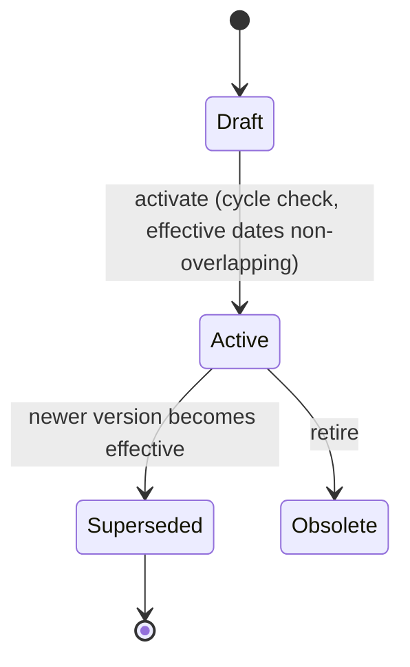
```mermaid
stateDiagram-v2
    [*] --> Draft
    Draft --> Active: activate (cycle check, effective dates non-overlapping)
    Active --> Superseded: newer version becomes effective
    Active --> Obsolete: retire
    Superseded --> [*]
```

### 10.4 MRP run

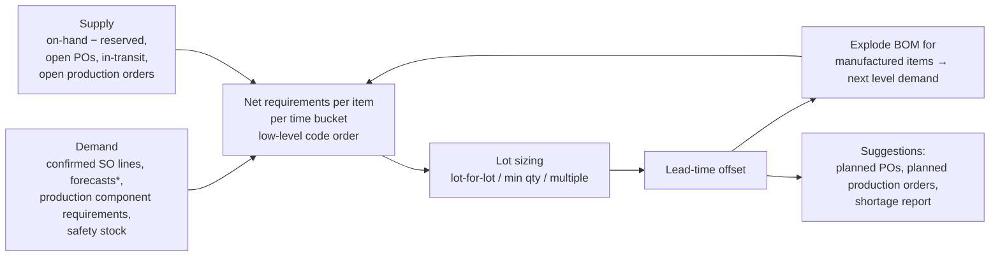
```mermaid
flowchart LR
    D[Demand<br/>confirmed SO lines, forecasts*,<br/>production component requirements,<br/>safety stock] --> N
    S[Supply<br/>on-hand − reserved,<br/>open POs, in-transit,<br/>open production orders] --> N
    N[Net requirements per item<br/>per time bucket<br/>low-level code order] --> L[Lot sizing<br/>lot-for-lot / min qty / multiple]
    L --> O[Lead-time offset]
    O --> E[Explode BOM for<br/>manufactured items → next level demand]
    E --> N
    O --> R[Suggestions:<br/>planned POs, planned production orders,<br/>shortage report]
```
\* forecasts are a later extension. v1 MRP is infinite-capacity (Part 11.5).

## POS shift lifecycle

```mermaid
stateDiagram-v2
    [*] --> Open: open shift (opening float counted)
    Open --> Open: receipts, refunds, pay-in / pay-out
    Open --> Closing: start close (no new receipts)
    Closing --> Closed: blind count per payment method → variance → post summary (sales journal by shift, cash over/short)
    Closed --> [*]
```
